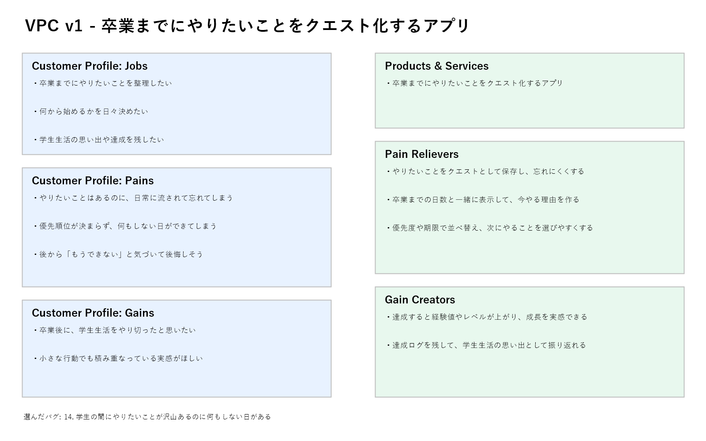

# VPC v1 - __hkr.lc

## 1. 解決したい困りごとを1つ選ぶ

**選んだ困りごと**:

学生の間にやりたいことが沢山あるのに何もしない日があるし、気が付いたらもうできないこともあるのが嫌だ。

---

## 2. 解決策のアイデア

**解決のアイデア**:

卒業までにやりたいことをクエスト化し、残り日数・優先度・達成記録を見える化するアプリ。

---

## 3. VPC本体

### Customer Profile(顧客側)

#### Jobs

- 卒業までにやりたいことを整理したい
- 何から始めるかを日々決めたい
- 学生生活の思い出や達成を残したい

#### Pains

- やりたいことはあるのに、日常に流されて忘れてしまう
- 優先順位が決まらず、何もしない日ができてしまう
- 後から「もうできない」と気づいて後悔しそう

#### Gains

- 卒業後に、学生生活をやり切ったと思いたい
- 小さな行動でも積み重なっている実感がほしい

---

### Value Map(サービス側)

#### Products & Services

- 卒業までにやりたいことをクエスト化するアプリ

#### Pain Relievers

- やりたいことをクエストとして保存し、忘れにくくする
- 卒業までの日数と一緒に表示して、今やる理由を作る
- 優先度や期限で並べ替え、次にやることを選びやすくする

#### Gain Creators

- 達成すると経験値やレベルが上がり、成長を実感できる
- 達成ログを残して、学生生活の思い出として振り返れる

---

## 4. Fit確認

| Pains/Gains | → | Pain Relievers / Gain Creators | チェック |
|---|---|---|---|
| やりたいことはあるのに、日常に流されて忘れてしまう | → | やりたいことをクエストとして保存し、忘れにくくする | OK |
| 優先順位が決まらず、何もしない日ができてしまう | → | 優先度や期限で並べ替え、次にやることを選びやすくする | OK |
| 後から「もうできない」と気づいて後悔しそう | → | 卒業までの日数と一緒に表示して、今やる理由を作る | OK |
| 卒業後に、学生生活をやり切ったと思いたい | → | 達成ログを残して、学生生活の思い出として振り返れる | OK |
| 小さな行動でも積み重なっている実感がほしい | → | 達成すると経験値やレベルが上がり、成長を実感できる | OK |
